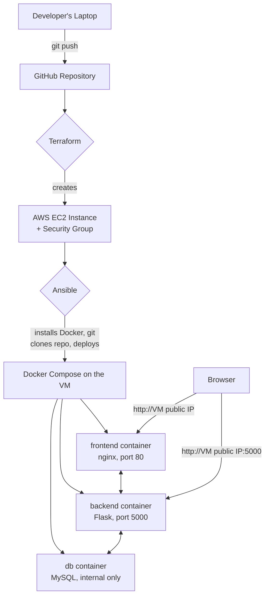
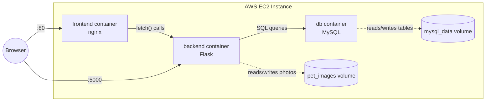
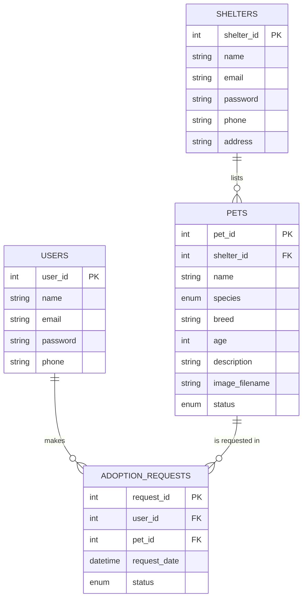
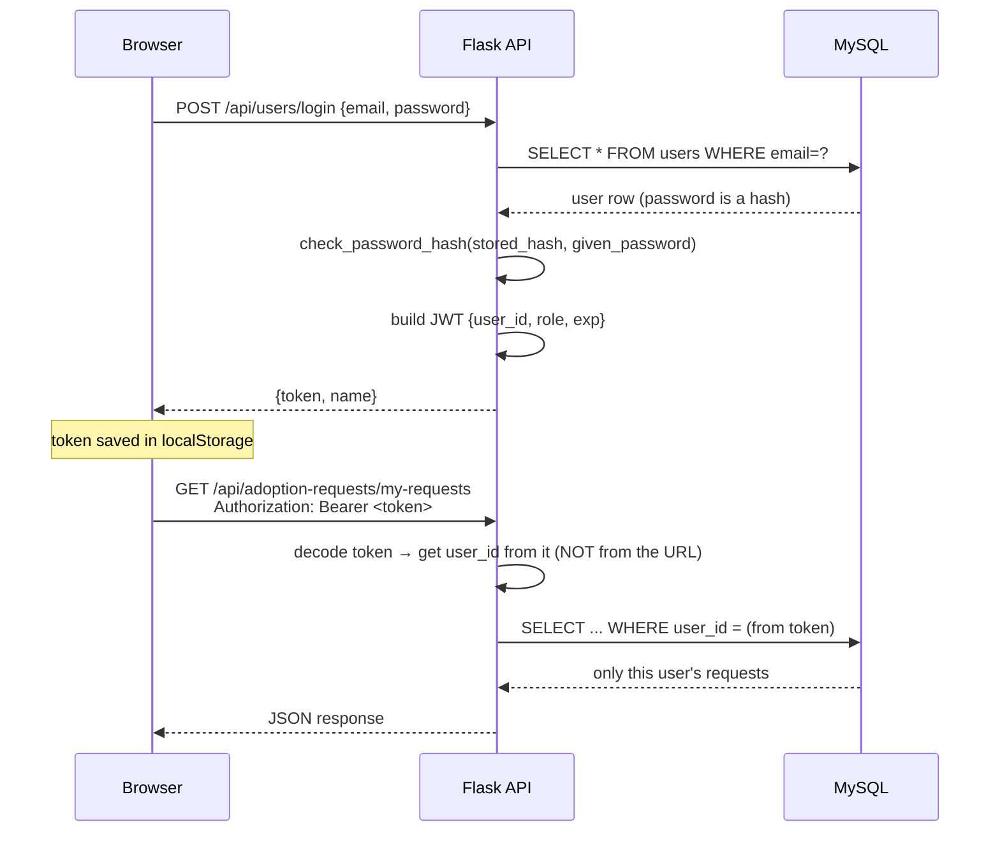
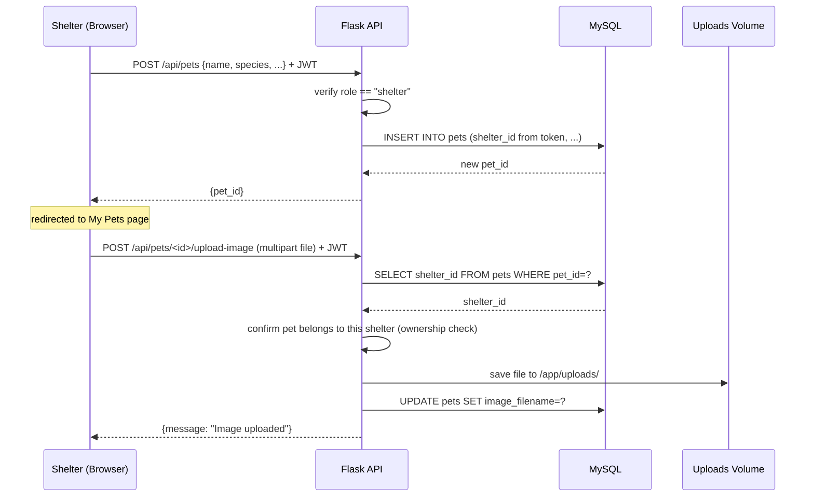
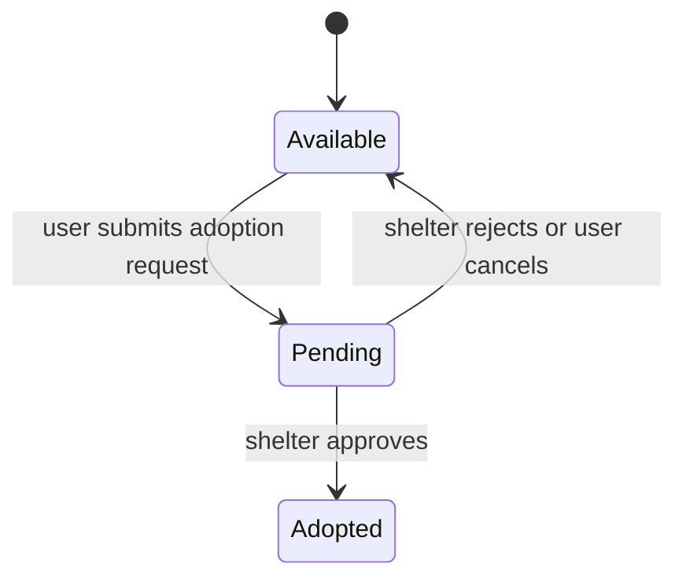

# Architecture — Pet Adoption Portal

Diagrams and data flows for the full system: the DevOps pipeline, the running containers, the database, and the key request flows through the app.

---

## 1. Deployment Pipeline (the DevOps part)

**Read it as:** code goes to GitHub → Terraform creates the server → Ansible configures the server and deploys the app → Docker Compose runs the 3 containers → the browser talks to the frontend and backend containers directly.

---

## 2. Container & Volume Layout

**Why the volumes matter:** `pet_images` and `mysql_data` live *outside* the containers' own filesystem. If a container is deleted and recreated (`docker compose down` then `up`), its own filesystem is thrown away and rebuilt from the image — but the volumes survive, so uploaded photos and database rows are untouched. Only `docker compose down -v` deletes the volumes themselves.

---

## 3. Database Schema (ER Diagram)

---

## 4. Request Flow — Login & Authorization

**Why "from the token, not the URL" matters:** this is the fix for the IDOR bug found during development — the server never trusts a client-supplied ID for "whose data is this," only what it verified via the token's signature.

---

## 5. Request Flow — Adding a Pet & Uploading a Photo

---

## 6. Request Flow — Adoption Request Lifecycle

A pet's `status` and its adoption request's `status` are always changed together in the same backend function — never independently — so they can't drift out of sync.

---

## 7. Security Model Summary

| Boundary | Enforced by |
|---|---|
| Must be logged in | `token_required` decorator checks a valid JWT on every protected route |
| Must be the right role (user vs shelter) | Each route checks `payload["role"]` after decoding the token |
| Must own the resource (a pet, a request) | The route fetches the resource's owner from the database and compares it to the token's identity before allowing edit/delete |
| Passwords | Hashed with Werkzeug's `generate_password_hash` — never stored or compared in plain text |
| File uploads | Extension whitelist (`png/jpg/jpeg/gif`) + `secure_filename()` to block path-traversal filenames |

For the two real ownership bugs found and fixed during development (any shelter could edit another shelter's pet), see [PROJECT_LOG.md](PROJECT_LOG.md), Step 13b.
